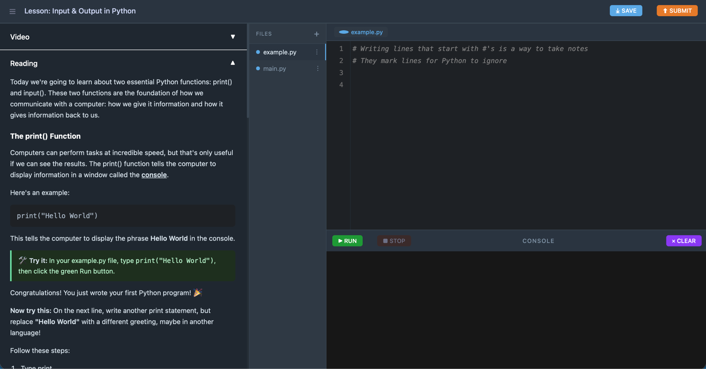

# **Class Outline**

There are two kinds of weeks in this course: New topic (regular) weeks and project weeks.

**Regular Weeks**: Watch a 10 minute or less video at home → 10-15 minute Demo by instructor → 50 minute exercise. Instructor and TA to help answer questions

**If not attending class**: Watch a 10 minute or less video at home → 50 minute exercise.

**Project Weeks**: Watch 10 minute video about Project & Read Project Spec → 10-15 minute explanation by instructor → Work on project for rest of week in class. Should be doable in 2-3 hours or 2 class periods. (Could do 1 large project the whole semester and each week you add to it.

**If not attending class**: Watch 10 minute video about Project & Read Project Spec → Work on project for rest of week in class. Should be doable in 2-3 hours or 2.5 class periods.

Alternatively, instead of doing individual small projects throughout the class you may work on one large project and add to it each project week.

**Notes:**

- 1:15  hour class, 2x a week
- Childcare in room next door for moms attending the class
- If attending class, no outside homework beyond the video or the reading
- Class is optional, if it doesn't fit circumstances, this can be decided on a weekly basis
    - Purpose: Extra Guidance if needed
    - Childcare for class time
    - Opportunity to work with peers
- Videos are accompanied by a reading of the same content if that is preferred over video, learners only need to review one of these options

**Schedule by Week (Assumes a BYU Semester)**

1. Variables and Data Types
    1. Print/Input/Variables
    2. Data Types/Type Conversion/String Formatting
2. Project
3. Operators
    1. Math operations/String operations/Comments
    2. Boolean and Logic
4. Project
5. Control Flow
    1. If / Elif / Else
    2. While Loops/For Loops
6. Project
7. Functions
    1. Defining and Calling \+ Return and None
    2. Variable Scope
8. Project
9. Data Structure: Lists
    1. Using Lists \+ List operations
    2. List Indexing/Splicing
10. Project
11. Data Structure: Dictionaries
    1. Using Dictionaries
    2. Dictionary operations
12. Project
13. IDE
    1. Intro to Pycharm: Install and set up
    2. Writing programs in Pycharm
14. Errors and Debugging
    1. Syntax \+ Runtime \+ Debugging in Pycharm
    2. Logic \+ Debugging
15. Review and Final Project
    1. Final project starts the week before finals and will be due at the end of finals

# **Interface for Lessons**

